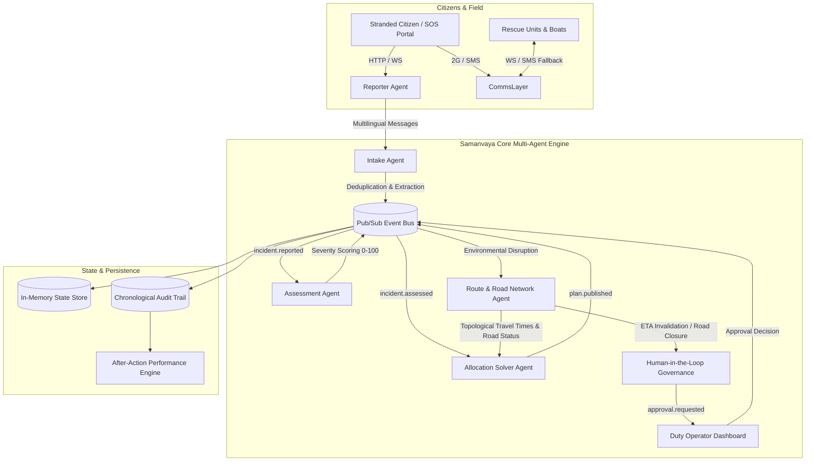

# Samanvaya · Flood Emergency Response System

> **Autonomous, Resilient Multi-Agent Flood Coordination & Emergency Response Engine**  
> Built for the 24-Hour Emergency Response Hackathon.

[](file:///c:/Projects/Samanvaya_24%C2%B0Shift/backend/tests)
[](file:///c:/Projects/Samanvaya_24%C2%B0Shift/backend/app/config.py)
[](file:///c:/Projects/Samanvaya_24%C2%B0Shift/docs/deploy.md)
[](https://sophisticated-debate-nurse-searching.trycloudflare.com)

---

## 1. Executive Summary

During major urban flooding events, municipal Emergency Operations Centers (EOCs) face a fatal coordination failure: **static whiteboards, fragmented phone lines, and radio traffic fail as water levels surge and road networks disintegrate**. Dispatch plans generated at the beginning of an hour are obsolete within ten minutes as bridges submerge and cell towers lose power.

**Samanvaya** (ಸಮನ್ವಯ — *Coordination / Harmony*) is a resilient, autonomous multi-agent system designed to orchestrate emergency triage, resource allocation, real-time rerouting, and citizen communication during catastrophe. It combines deterministic graph heuristics and multi-objective optimization with Human-in-the-Loop (HITL) governance, remaining operational even during total grid failure through asynchronous SMS mesh fallback.

---

## 2. Multi-Agent Architecture



### The Seven Core Agents & Systems:

1. **Intake Agent (`app/agents/intake.py`)**:
   - Ingests emergency distress requests across channels (web SOS, phone-in calls, voice recordings).
   - Performs native multilingual processing for **English**, **Kannada (ಕನ್ನಡ)**, and **Hindi (हिन्दी)**.
   - Spatial-temporal deduplication: identifies reports within 100 meters and 10 scenario minutes of an existing incident, automatically aggregating trapped victim counts and updating highest severity.

2. **Assessment Agent (`app/agents/assessment.py`)**:
   - **Zero Hallucination Guarantee**: Strictly rule-based, deterministic severity evaluation (no LLM hallucination in safety-critical scoring).
   - Computes dynamic `severityScore` (0–100) based on incident type base weights, affected persons, vulnerable demographics (elderly, children), live rainfall intensity, and water elevation.
   - Categorizes incidents into tiers (`critical`, `high`, `medium`, `low`) and assigns strict triage time windows (10 min for critical to 60 min for low).

3. **Allocation Solver Agent (`app/agents/allocation.py`)**:
   - Multi-objective dispatch solver matching incidents with available rescue assets (ambulances, inflatable rescue boats, NDRF evacuation trucks).
   - Optimizes for capability matching, vehicle battery/fuel range, travel time uncertainty, and triage urgency.
   - Generates and publishes versioned dispatch plans (`PLAN-001`, `PLAN-002`).

4. **Route & Road Network Agent (`app/agents/route.py`)**:
   - Maintains a directed topological graph of municipal road corridors, elevation underpasses, and bridges.
   - Monitors environmental rainfall telemetry in real time: automatically marks flooded roads as `closed` (e.g. `ROAD-04`) and waterlogged roads as `slow` (e.g. `ROAD-05`).
   - Recomputes Dijkstra shortest paths and calculates travel time intervals with uncertainty margins (e.g. `[12, 18]` minutes).

5. **Human-in-the-Loop Governance Engine (`app/routers/approvals.py`)**:
   - When environmental conditions disrupt active plans, the system generates structured approval tickets (`APR-001`).
   - Presents the operator with actionable options (e.g., Option A: Reassign nearest rescue unit vs Option B: Maintain assignment with delay).
   - Requires explicit operator sign-off before plan execution, ensuring ultimate human command.

6. **Comms & Outage Resilient Mesh (`app/comms.py`, `app/routers/sms.py`)**:
   - Continuous heartbeat monitoring across operational zones (`ZONE-A`, `ZONE-B`, `ZONE-C`).
   - When cell towers or internet backhaul drop (`zone.comms_degraded`), automatically diverts all dispatches and crew acknowledgments to two-way asynchronous SMS.

7. **After-Action Reporting Engine (`app/routers/reports.py`)**:
   - Cryptographic, sequential audit logging of every event, telemetry tick, and human decision.
   - Produces quantitative post-disaster analytics: response times vs target windows, vehicle utilization rates, road impassability timelines, and communication fallback ratios.

---

## 3. Directory Layout

```
Samanvaya_24°Shift/
├── contracts/                  # Single source of truth (Shared types, schemas, seed)
│   ├── types.ts                # TypeScript domain models and interfaces
│   ├── events.md               # WebSocket event catalog and payload definitions
│   ├── endpoints.md            # REST API specifications and role requirements
│   └── seed/                   # Official scenario fixtures (roads, units, zones, events)
├── backend/                    # High-performance FastAPI server & Multi-Agent Brain
│   ├── app/
│   │   ├── agents/             # Autonomous agent implementations (Intake, Assessment, Route, Allocation)
│   │   ├── routers/            # Clean REST endpoints & WebSocket channels
│   │   ├── bus.py              # In-memory pub/sub asynchronous event bus
│   │   ├── state.py            # Reactive state management store
│   │   ├── clock.py            # Scenario-time clock engine (09:00:00 baseline)
│   │   └── main.py             # Single-origin server with SPA static fallback
│   ├── tests/                  # Exhaustive test suite (269 tests across stub & real modes)
│   └── scripts/                # Verification and scenario director utilities
├── frontend/                   # Tactical Obsidian Dark Command Center (React + TypeScript)
│   ├── src/
│   │   ├── components/         # Map, IncidentQueue, AgentStream, ResourceBoard, TopBar
│   │   ├── pages/              # CommandCenter, PlanDiff, Approvals, Crew, SOS, AfterAction
│   │   ├── realtime/           # Live WebSocket client & event mapper
│   │   └── store/              # Zustand state store with offline persistence
│   └── dist/                   # Production-built static assets served by FastAPI
└── docs/                       # Runbooks, deployment guides, and design specifications
```

---

## 4. Quick Start & Setup

### Prerequisites
- **Python**: 3.10+ (tested on Python 3.11)
- **Node.js**: 18+ (tested on Node 20+)

### 1. Build the Frontend
```bash
cd frontend
npm install
npm run build
```

### 2. Launch the Backend (Single-Origin Port 8000)
FastAPI serves the REST API, WebSocket streams, and frontend static assets simultaneously on `http://localhost:8000`:

```bash
cd ../backend
pip install -r requirements.txt

# PowerShell:
$env:ENGINE_MODE="real"; $env:LLM_MODE="scripted"; $env:DEV_MODE="true"; .venv\Scripts\uvicorn app.main:app --host 0.0.0.0 --port 8000

# Linux / macOS:
export ENGINE_MODE="real" LLM_MODE="scripted" DEV_MODE="true" && uvicorn app.main:app --host 0.0.0.0 --port 8000
```

### 3. Open in Browser
- **Command Center Dashboard**: [http://localhost:8000/command](http://localhost:8000/command)  
  *Credentials*: Username `operator` | Password `demo1234`
- **Citizen Emergency SOS Portal**: [http://localhost:8000/sos](http://localhost:8000/sos) (multilingual en/kn/hi)
- **Field Crew Portal**: [http://localhost:8000/crew](http://localhost:8000/crew) (Unit code: `AMB-01`, PIN: `1111`)
- **After-Action Analytics**: [http://localhost:8000/after-action](http://localhost:8000/after-action)
- **Interactive OpenAPI Docs**: [http://localhost:8000/docs](http://localhost:8000/docs)

---

## 5. Public Deployment & Remote Access

To present the live emergency deployment to remote evaluators without configuring port-forwarding or reverse proxies:

```bash
cloudflared tunnel --url http://localhost:8000
```

The application automatically supports:
- HTTPS on all routes (`/sos`, `/command`, `/login`).
- Automatic secure WebSocket upgrades (`wss://`) derived dynamically from `window.location`.
- Complete details available in [docs/deploy.md](file:///c:/Projects/Samanvaya_24%C2%B0Shift/docs/deploy.md).

---

## 6. Test Suite & Verification

The backend includes 269 comprehensive unit, contract, and integration tests verifying all 6 scenario flows, role-based security, and event bus pub/sub consistency:

```bash
cd backend
# Run full suite in real engine mode
pytest -v

# Output:
# ======================== 269 passed, 1 warning in 34.81s ========================
```

---

## 7. License

Built for open civic disaster resilience. Distributed under the MIT License.
